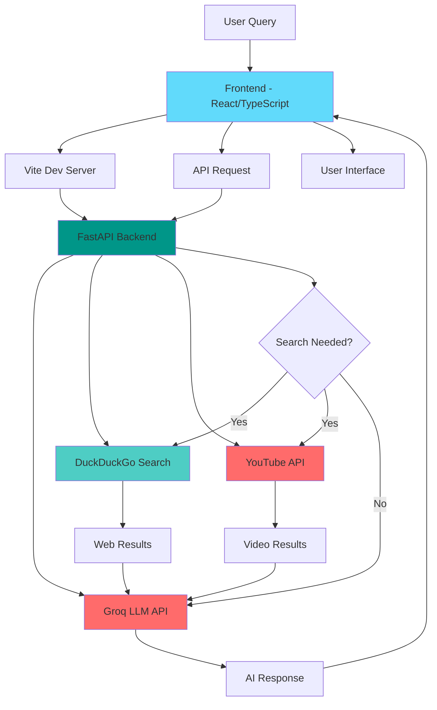
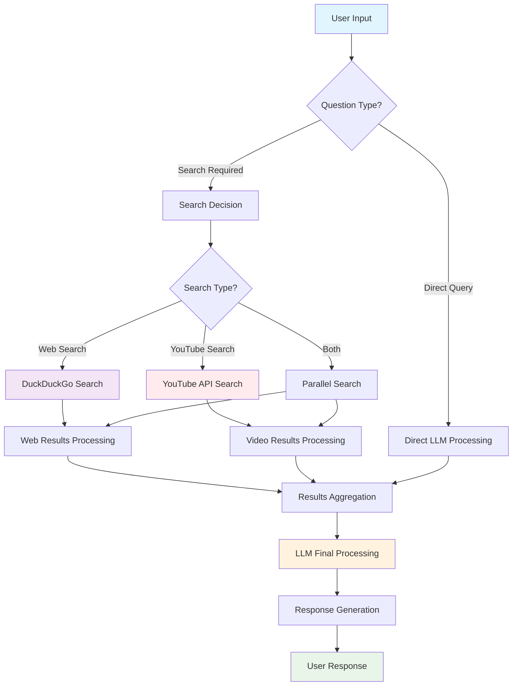
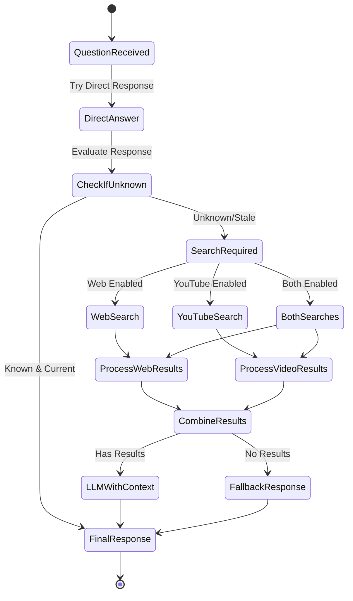

# 🧠 SmartGeni - AI-Powered Knowledge Assistant

<p align="center">
  
</p>

<p align="center">
  <strong>An intelligent AI assistant that provides accurate answers with web search and YouTube integration</strong>
</p>

<p align="center">
  <a href="#features">Features</a> •
  <a href="#architecture">Architecture</a> •
  <a href="#quick-start">Quick Start</a> •
  <a href="#deployment">Deployment</a> •
  <a href="#api-docs">API</a>
</p>

---

## ✨ Features

- 🔍 **Smart Web Search** - Enhanced search capabilities with DuckDuckGo integration
- 📺 **YouTube Integration** - Find relevant video content for your queries
- 🧠 **Advanced AI** - Powered by Groq's LLaMA models for intelligent responses
- 🎨 **Modern UI** - Beautiful, responsive interface built with React and Tailwind CSS
- 🔄 **Real-time Processing** - Fast, efficient question-answering system
- 📱 **Mobile Responsive** - Works seamlessly across all devices
- 🛡️ **Secure** - Built with modern security practices

## 🏗️ Architecture



## 🚀 Quick Start

### Prerequisites

- **Node.js** (v18 or higher) - [Install with nvm](https://github.com/nvm-sh/nvm#installing-and-updating)
- **Python** (v3.8 or higher)
- **Git**

### 🔧 Installation

1. **Clone the repository**
   ```bash
   git clone <YOUR_GIT_URL>
   cd SmartGeni
   ```

2. **Set up the Backend**
   ```bash
   cd backend
   pip install -r requirements.txt
   
   # Create environment file
   cp .env.example .env
   # Add your API keys to .env file
   ```

3. **Set up the Frontend**
   ```bash
   cd ../frontend
   npm install
   ```

4. **Configure Environment Variables**
   
   Create a `.env` file in the backend directory:
   ```env
   GROQ_API_KEY=your_groq_api_key_here
   YOUTUBE_API_KEY=your_youtube_api_key_here
   GROQ_MODEL_NAME=llama3-8b-8192
   MODEL_TEMPERATURE=0.3
   ENABLE_WEB_SEARCH=true
   ENABLE_YOUTUBE_SEARCH=true
   ```

### 🎯 Running the Application

1. **Start the Backend Server**
   ```bash
   cd backend
   python app.py
   ```
   Backend will be available at `http://localhost:8000`

2. **Start the Frontend Development Server**
   ```bash
   cd frontend
   npm run dev
   ```
   Frontend will be available at `http://localhost:8080`

3. **Health Check**
   ```bash
   curl http://localhost:8000/health
   ```

## 📁 Project Structure

```
SmartGeni/
├── 📁 backend/
│   ├── app.py              # FastAPI application
│   ├── requirements.txt    # Python dependencies
│   └── .env               # Environment variables
├── 📁 frontend/
│   ├── 📁 src/
│   │   ├── 📁 components/  # React components
│   │   ├── 📁 pages/      # Application pages
│   │   ├── 📁 hooks/      # Custom React hooks
│   │   └── 📁 lib/        # Utility functions
│   ├── 📁 public/         # Static assets
│   ├── package.json       # Node.js dependencies
│   └── vite.config.ts     # Vite configuration
└── README.md              # This file
```

## 🛠️ Technology Stack

### Frontend
- **⚛️ React 18** - Modern React with hooks
- **📘 TypeScript** - Type-safe JavaScript
- **⚡ Vite** - Lightning-fast build tool
- **🎨 Tailwind CSS** - Utility-first CSS framework
- **🧩 shadcn/ui** - High-quality UI components
- **🎭 Framer Motion** - Smooth animations
- **🔄 React Query** - Data fetching and caching

### Backend
- **🐍 FastAPI** - Modern, fast web framework for Python
- **🦜 LangChain** - LLM application framework
- **🚀 Groq** - Ultra-fast LLM inference
- **🔍 DuckDuckGo Search** - Privacy-focused web search
- **📺 YouTube API** - Video content integration
- **🔄 Uvicorn** - ASGI server implementation

## 🚀 Development Commands

### Frontend Commands
```bash
# Install dependencies
npm install

# Start development server
npm run dev

# Build for production
npm run build

# Preview production build
npm run preview

# Lint code
npm run lint
```

### Backend Commands
```bash
# Install dependencies
pip install -r requirements.txt

# Start development server with auto-reload
python app.py

# Start production server
uvicorn app:app --host 0.0.0.0 --port 8000

# Health check
curl http://localhost:8000/health
```

## 📡 API Documentation

### Endpoints

#### `POST /ask`
Submit a question to the AI assistant.

**Request Body:**
```json
{
  "question": "What is artificial intelligence?",
  "include_youtube": true
}
```

**Response:**
```json
{
  "answer": "Artificial intelligence (AI) refers to...",
  "source": "groq_ai_with_search",
  "confidence": "high",
  "search_performed": true,
  "youtube_search_performed": true,
  "search_queries_used": ["artificial intelligence basics"],
  "source_urls": ["https://example.com"],
  "youtube_videos": [
    {
      "title": "AI Explained",
      "url": "https://youtube.com/watch?v=xyz",
      "thumbnail": "https://img.youtube.com/vi/xyz/default.jpg"
    }
  ]
}
```

#### `GET /health`
Check the health status of all services.

**Response:**
```json
{
  "status": "healthy",
  "timestamp": "2025-06-26T10:30:00Z",
  "llm_service": {
    "status": "connected",
    "model_name": "llama3-8b-8192"
  },
  "web_search_service": {
    "configured_enabled": true,
    "tool_status": "tool_initialized_and_ready"
  },
  "youtube_search_service": {
    "configured_enabled": true,
    "api_key_configured": true,
    "status": "enabled_with_api_key"
  }
}
```

## 🚀 Deployment

### Option 1: Docker Deployment (Recommended)

1. **Create Dockerfile for Backend**
   ```dockerfile
   FROM python:3.9-slim
   WORKDIR /app
   COPY requirements.txt .
   RUN pip install -r requirements.txt
   COPY . .
   EXPOSE 8000
   CMD ["uvicorn", "app:app", "--host", "0.0.0.0", "--port", "8000"]
   ```

2. **Create Dockerfile for Frontend**
   ```dockerfile
   FROM node:18-alpine
   WORKDIR /app
   COPY package*.json .
   RUN npm install
   COPY . .
   RUN npm run build
   EXPOSE 8080
   CMD ["npm", "run", "preview"]
   ```

3. **Create docker-compose.yml**
   ```yaml
   version: '3.8'
   services:
     backend:
       build: ./backend
       ports:
         - "8000:8000"
       environment:
         - GROQ_API_KEY=${GROQ_API_KEY}
         - YOUTUBE_API_KEY=${YOUTUBE_API_KEY}
     
     frontend:
       build: ./frontend
       ports:
         - "8080:8080"
       depends_on:
         - backend
   ```

### Option 2: Traditional Deployment

**Backend (Python/FastAPI):**
- Deploy to platforms like Railway, Render, or DigitalOcean
- Set environment variables in your deployment platform
- Use `uvicorn app:app --host 0.0.0.0 --port $PORT`

**Frontend (React/Vite):**
- Build with `npm run build`
- Deploy to Vercel, Netlify, or any static hosting service
- Update API endpoint in production configuration

## 🔧 Configuration

### Environment Variables

| Variable | Description | Default | Required |
|----------|-------------|---------|----------|
| `GROQ_API_KEY` | Groq API key for LLM access | - | ✅ |
| `YOUTUBE_API_KEY` | YouTube Data API key | - | ❌ |
| `GROQ_MODEL_NAME` | Groq model to use | `llama3-8b-8192` | ❌ |
| `MODEL_TEMPERATURE` | AI response creativity (0-1) | `0.3` | ❌ |
| `ENABLE_WEB_SEARCH` | Enable web search functionality | `true` | ❌ |
| `ENABLE_YOUTUBE_SEARCH` | Enable YouTube search | `true` | ❌ |
| `MAX_SEARCH_RESULTS_CHARS` | Limit search content length | `3500` | ❌ |

## 🤝 Contributing

1. **Fork the repository**
2. **Create a feature branch** (`git checkout -b feature/amazing-feature`)
3. **Commit your changes** (`git commit -m 'Add amazing feature'`)
4. **Push to the branch** (`git push origin feature/amazing-feature`)
5. **Open a Pull Request**

### Development Guidelines

- Follow TypeScript best practices
- Use ESLint and Prettier for code formatting
- Write meaningful commit messages
- Add tests for new features
- Update documentation as needed

## 📊 System Flow Chart



## 🔍 Search Logic Flow



## 📝 License

This project is licensed under the MIT License - see the [LICENSE](LICENSE) file for details.

## 🐛 Troubleshooting

### Common Issues

**Backend won't start:**
```bash
# Check if all dependencies are installed
pip install -r requirements.txt

# Verify environment variables
cat .env

# Check port availability
lsof -i :8000
```

**Frontend build fails:**
```bash
# Clear cache and reinstall
rm -rf node_modules package-lock.json
npm install

# Check Node.js version
node --version  # Should be 18+
```

**API requests failing:**
- Check if backend is running on port 8000
- Verify CORS configuration
- Check network connectivity
- Validate API keys in environment

## 🙋‍♂️ Support

If you encounter any issues or have questions:

1. Check the [Issues](../../issues) page
2. Create a new issue with detailed information
3. Include error logs and environment details

---

<p align="center">
  Made with ❤️ by the SmartGeni Team
</p>
