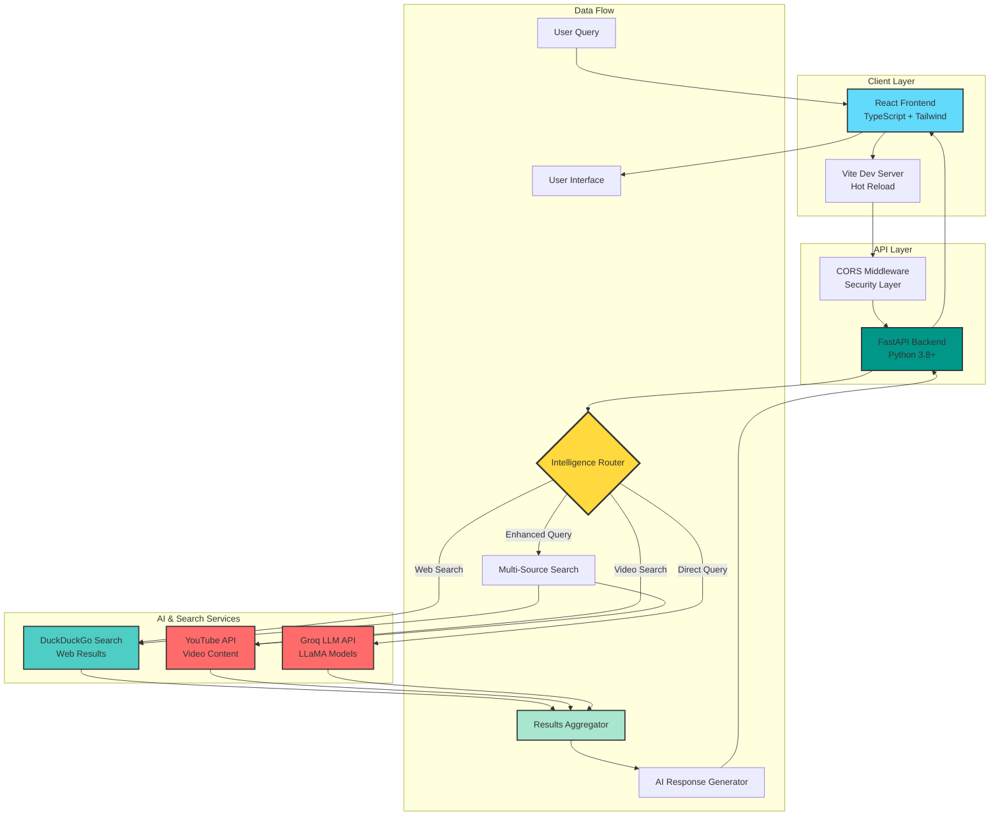
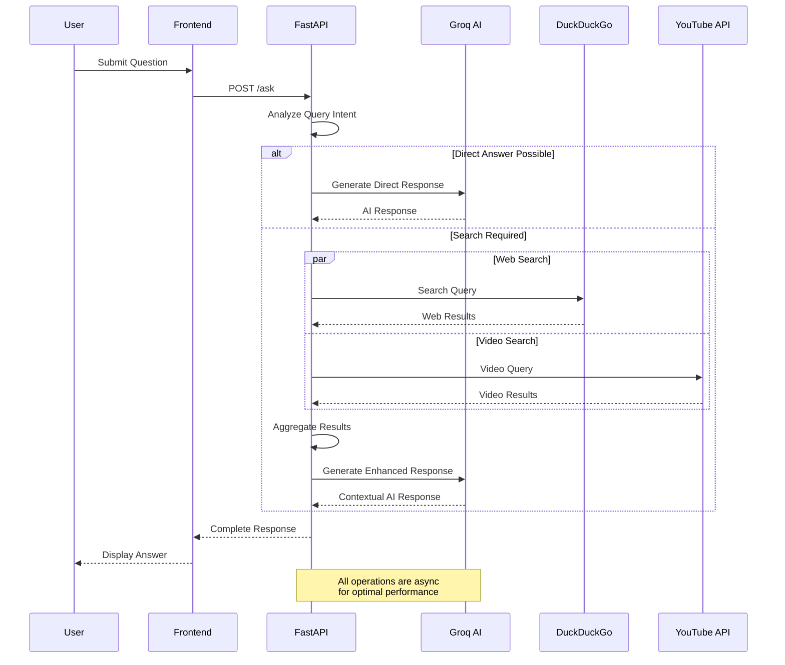
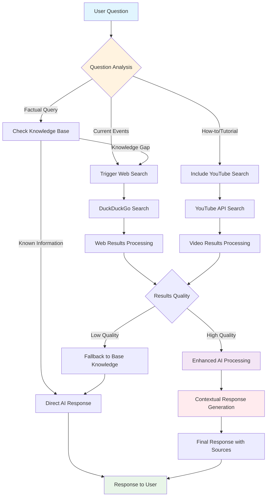
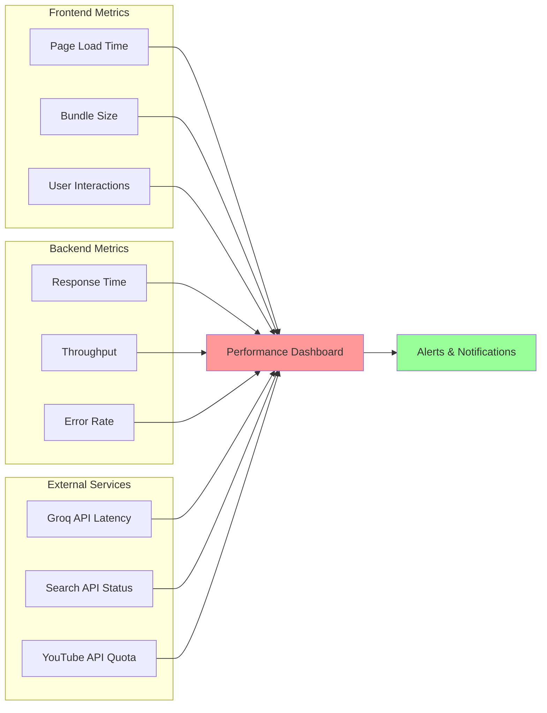
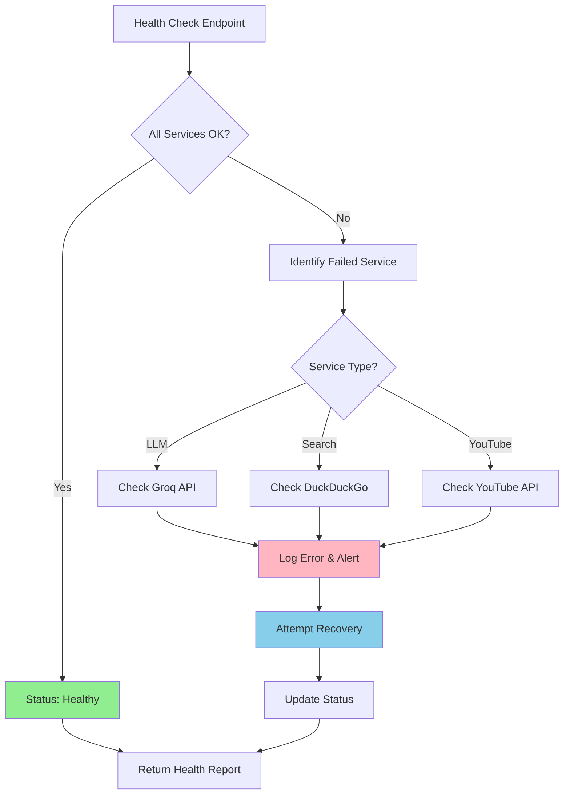

# 🧠 SmartGeni - AI-Powered Knowledge Assistant

<div align="center">
  
  
  <h3>🚀 An intelligent AI assistant that provides accurate answers with web search and YouTube integration</h3>
  
  [](https://opensource.org/licenses/MIT)
  [](https://www.python.org/downloads/)
  [](https://nodejs.org/)
  [](https://fastapi.tiangolo.com/)
  [](https://reactjs.org/)
</div>

<div align="center">
  <a href="#-features">Features</a> •
  <a href="#-architecture">Architecture</a> •
  <a href="#-quick-start">Quick Start</a> •
  <a href="#-deployment">Deployment</a> •
  <a href="#-api-documentation">API</a> •
  <a href="#-contributing">Contributing</a>
</div>

---

## 🌟 Features

<table>
<tr>
<td width="50%">

### 🔍 **Intelligent Search**
- Enhanced web search with DuckDuckGo
- Real-time information retrieval
- Context-aware search queries

### 🧠 **Advanced AI**
- Powered by Groq's LLaMA models
- High-speed inference
- Context-aware responses

### 🎨 **Modern Interface**
- Beautiful React + Tailwind UI
- Responsive design
- Real-time chat experience

</td>
<td width="50%">

### 📺 **YouTube Integration**
- Relevant video content search
- Thumbnail previews
- Direct video links

### 🔒 **Security & Performance**
- Modern security practices
- Fast API responses
- Optimized data flow

### 📱 **Cross-Platform**
- Mobile responsive
- Progressive Web App ready
- Offline capabilities

</td>
</tr>
</table>

## 🏗️ Architecture

### System Overview


### Request Processing Flow


## 🚀 Quick Start

### Prerequisites

Ensure you have the following installed:

```bash
# Check versions
node --version    # v18.0.0 or higher
python --version  # 3.8.0 or higher
git --version     # Any recent version
```

### 🔧 Installation Steps

#### 1. **Clone Repository**
```bash
git clone https://github.com/yourusername/SmartGeni.git
cd SmartGeni
```

#### 2. **Backend Setup**
```bash
cd backend

# Create virtual environment (recommended)
python -m venv venv
source venv/bin/activate  # On Windows: venv\Scripts\activate

# Install dependencies
pip install -r requirements.txt

# Setup environment
cp .env.example .env
# Edit .env with your API keys
```

#### 3. **Frontend Setup**
```bash
cd ../frontend

# Install dependencies
npm install

# Optional: Update packages
npm audit fix
```

#### 4. **Environment Configuration**

Create `backend/.env` file:
```env
# Required
GROQ_API_KEY=your_groq_api_key_here

# Optional
YOUTUBE_API_KEY=your_youtube_api_key_here
GROQ_MODEL_NAME=llama3-8b-8192
MODEL_TEMPERATURE=0.3
ENABLE_WEB_SEARCH=true
ENABLE_YOUTUBE_SEARCH=true
MAX_SEARCH_RESULTS_CHARS=3500
```

### 🎯 Running the Application

#### Development Mode

**Terminal 1 - Backend:**
```bash
cd backend
python app.py
# 🚀 Server: http://localhost:8000
# 📚 Docs: http://localhost:8000/docs
```

**Terminal 2 - Frontend:**
```bash
cd frontend
npm run dev
# 🎨 App: http://localhost:8080
```

#### Health Check
```bash
curl -s http://localhost:8000/health | jq
```

Expected response:
```json
{
  "status": "healthy",
  "timestamp": "2025-06-26T10:30:00Z",
  "services": {
    "llm": "connected",
    "web_search": "enabled",
    "youtube": "configured"
  }
}
```

## 📁 Project Structure

```
SmartGeni/
├── 🗂️ backend/
│   ├── 📄 app.py                 # FastAPI application entry point
│   ├── 📁 routers/               # API route handlers
│   ├── 📁 services/              # Business logic layer
│   │   ├── ai_service.py         # Groq AI integration
│   │   ├── search_service.py     # Web search logic
│   │   └── youtube_service.py    # YouTube API integration
│   ├── 📁 models/                # Pydantic data models
│   ├── 📁 utils/                 # Helper functions
│   ├── 📄 requirements.txt       # Python dependencies
│   └── 📄 .env                   # Environment variables
├── 🗂️ frontend/
│   ├── 📁 src/
│   │   ├── 📁 components/        # Reusable React components
│   │   │   ├── ui/               # shadcn/ui components
│   │   │   ├── chat/             # Chat interface components
│   │   │   └── layout/           # Layout components
│   │   ├── 📁 pages/             # Application pages
│   │   ├── 📁 hooks/             # Custom React hooks
│   │   ├── 📁 lib/               # Utility functions
│   │   ├── 📁 types/             # TypeScript type definitions
│   │   └── 📄 main.tsx           # Application entry point
│   ├── 📁 public/                # Static assets
│   ├── 📄 package.json           # Node.js dependencies
│   ├── 📄 vite.config.ts         # Vite build configuration
│   └── 📄 tailwind.config.js     # Tailwind CSS configuration
├── 📁 docs/                      # Documentation
├── 📁 tests/                     # Test files
└── 📄 README.md                  # This file
```

## 🛠️ Technology Stack

<table>
<tr>
<td width="50%">

### Frontend Stack
- **⚛️ React 18** - Component-based UI
- **📘 TypeScript** - Type safety
- **⚡ Vite** - Fast build tool
- **🎨 Tailwind CSS** - Utility-first styling
- **🧩 shadcn/ui** - Premium components
- **🎭 Framer Motion** - Smooth animations
- **🔄 TanStack Query** - Server state management
- **🛣️ React Router** - Client-side routing

</td>
<td width="50%">

### Backend Stack
- **🐍 FastAPI** - Modern Python web framework
- **🦜 LangChain** - LLM orchestration
- **🚀 Groq** - High-speed LLM inference
- **🔍 DuckDuckGo** - Privacy-focused search
- **📺 YouTube Data API** - Video integration
- **🔄 Uvicorn** - ASGI server
- **📊 Pydantic** - Data validation
- **🔒 python-dotenv** - Environment management

</td>
</tr>
</table>

## 📡 API Documentation

### Core Endpoints

#### `POST /ask` - Submit Question
Submit a question to the AI assistant with optional search integration.

**Request:**
```json
{
  "question": "What are the latest developments in quantum computing?",
  "include_youtube": true,
  "search_depth": "comprehensive"
}
```

**Response:**
```json
{
  "answer": "Recent developments in quantum computing include...",
  "metadata": {
    "source": "groq_ai_with_search",
    "confidence": "high",
    "processing_time_ms": 1250,
    "search_performed": true,
    "youtube_search_performed": true
  },
  "sources": {
    "web_results": [
      {
        "title": "Quantum Computing Breakthrough 2025",
        "url": "https://example.com/quantum-news",
        "snippet": "Scientists achieve new milestone..."
      }
    ],
    "youtube_videos": [
      {
        "title": "Quantum Computing Explained",
        "url": "https://youtube.com/watch?v=xyz123",
        "thumbnail": "https://img.youtube.com/vi/xyz123/default.jpg",
        "channel": "Tech Explained",
        "duration": "10:45"
      }
    ]
  }
}
```

#### `GET /health` - System Health Check
Comprehensive health check for all system components.

**Response:**
```json
{
  "status": "healthy",
  "timestamp": "2025-06-26T10:30:00Z",
  "version": "1.0.0",
  "services": {
    "llm_service": {
      "status": "connected",
      "model_name": "llama3-8b-8192",
      "response_time_ms": 45
    },
    "web_search_service": {
      "status": "enabled",
      "last_test": "2025-06-26T10:29:30Z"
    },
    "youtube_service": {
      "status": "configured",
      "api_quota_remaining": 8750
    }
  },
  "performance": {
    "avg_response_time_ms": 892,
    "requests_per_minute": 12,
    "uptime_seconds": 86400
  }
}
```

### Search Intelligence Flow



## 🚀 Deployment

### Docker Deployment (Recommended)

#### 1. Create Docker Configuration

**Backend Dockerfile:**
```dockerfile
FROM python:3.11-slim

WORKDIR /app

# Install system dependencies
RUN apt-get update && apt-get install -y \
    gcc \
    && rm -rf /var/lib/apt/lists/*

# Install Python dependencies
COPY requirements.txt .
RUN pip install --no-cache-dir -r requirements.txt

# Copy application code
COPY . .

# Expose port
EXPOSE 8000

# Health check
HEALTHCHECK --interval=30s --timeout=3s --start-period=5s --retries=3 \
  CMD curl -f http://localhost:8000/health || exit 1

# Start application
CMD ["uvicorn", "app:app", "--host", "0.0.0.0", "--port", "8000", "--workers", "4"]
```

**Frontend Dockerfile:**
```dockerfile
FROM node:18-alpine as build

WORKDIR /app

# Install dependencies
COPY package*.json ./
RUN npm ci --only=production

# Build application
COPY . .
RUN npm run build

# Production stage
FROM nginx:alpine
COPY --from=build /app/dist /usr/share/nginx/html
COPY nginx.conf /etc/nginx/nginx.conf

EXPOSE 80
CMD ["nginx", "-g", "daemon off;"]
```

#### 2. Docker Compose Configuration

```yaml
version: '3.8'

services:
  backend:
    build: 
      context: ./backend
      dockerfile: Dockerfile
    ports:
      - "8000:8000"
    environment:
      - GROQ_API_KEY=${GROQ_API_KEY}
      - YOUTUBE_API_KEY=${YOUTUBE_API_KEY}
      - ENVIRONMENT=production
    healthcheck:
      test: ["CMD", "curl", "-f", "http://localhost:8000/health"]
      interval: 30s
      timeout: 10s
      retries: 3
    restart: unless-stopped

  frontend:
    build:
      context: ./frontend
      dockerfile: Dockerfile
    ports:
      - "80:80"
    depends_on:
      backend:
        condition: service_healthy
    restart: unless-stopped

  redis:
    image: redis:alpine
    ports:
      - "6379:6379"
    restart: unless-stopped

volumes:
  redis_data:
```

#### 3. Deployment Commands

```bash
# Build and start services
docker-compose up --build -d

# View logs
docker-compose logs -f

# Scale backend
docker-compose up --scale backend=3 -d

# Health check
docker-compose exec backend curl http://localhost:8000/health
```

### Cloud Deployment Options

<table>
<tr>
<td width="33%">

#### **🚀 Vercel + Railway**
- Frontend: Vercel
- Backend: Railway
- Database: Railway Redis
- **Best for:** Quick deployment

</td>
<td width="33%">

#### **☁️ AWS Deployment**
- Frontend: S3 + CloudFront
- Backend: ECS or Lambda
- Database: ElastiCache
- **Best for:** Enterprise scale

</td>
<td width="33%">

#### **🐋 DigitalOcean**
- App Platform
- Managed Database
- CDN Integration
- **Best for:** Balanced cost/performance

</td>
</tr>
</table>

## 🔧 Configuration

### Environment Variables Reference

| Variable | Description | Default | Required | Example |
|----------|-------------|---------|----------|---------|
| `GROQ_API_KEY` | Groq API authentication key | - | ✅ | `gsk_...` |
| `YOUTUBE_API_KEY` | YouTube Data API key | - | ❌ | `AIza...` |
| `GROQ_MODEL_NAME` | Groq model identifier | `llama3-8b-8192` | ❌ | `llama3-70b-8192` |
| `MODEL_TEMPERATURE` | AI creativity level (0-1) | `0.3` | ❌ | `0.7` |
| `ENABLE_WEB_SEARCH` | Enable web search feature | `true` | ❌ | `false` |
| `ENABLE_YOUTUBE_SEARCH` | Enable YouTube integration | `true` | ❌ | `false` |
| `MAX_SEARCH_RESULTS_CHARS` | Limit search content size | `3500` | ❌ | `5000` |
| `CORS_ORIGINS` | Allowed frontend origins | `["http://localhost:8080"]` | ❌ | `["https://myapp.com"]` |
| `LOG_LEVEL` | Application logging level | `INFO` | ❌ | `DEBUG` |

### Advanced Configuration

```python
# backend/config.py
from pydantic_settings import BaseSettings

class Settings(BaseSettings):
    # API Configuration
    groq_api_key: str
    youtube_api_key: str = None
    
    # Model Configuration
    groq_model_name: str = "llama3-8b-8192"
    model_temperature: float = 0.3
    max_tokens: int = 4000
    
    # Search Configuration
    enable_web_search: bool = True
    enable_youtube_search: bool = True
    max_search_results: int = 5
    search_timeout: int = 10
    
    # Performance
    request_timeout: int = 30
    rate_limit_per_minute: int = 60
    
    class Config:
        env_file = ".env"
```

## 🧪 Testing

### Running Tests

```bash
# Backend tests
cd backend
pytest tests/ -v --cov=app

# Frontend tests
cd frontend
npm test

# Integration tests
npm run test:e2e
```

### Test Structure

```
tests/
├── backend/
│   ├── test_api.py           # API endpoint tests
│   ├── test_services.py      # Service layer tests
│   └── test_integration.py   # Integration tests
├── frontend/
│   ├── components/           # Component tests
│   ├── hooks/               # Custom hook tests
│   └── e2e/                 # End-to-end tests
└── fixtures/                # Test data
```

## 🤝 Contributing

We welcome contributions! Please follow these guidelines:

### Development Workflow

```mermaid
gitgraph
    commit id: "main"
    branch feature/new-search
    checkout feature/new-search
    commit id: "Add search logic"
    commit id: "Add tests"
    commit id: "Update docs"
    checkout main
    merge feature/new-search
    commit id: "Release v1.1.0"
```

### Contribution Steps

1. **Fork the repository**
2. **Create feature branch:** `git checkout -b feature/amazing-feature`
3. **Make changes and add tests**
4. **Ensure code quality:**
   ```bash
   # Backend
   black backend/
   flake8 backend/
   pytest
   
   # Frontend
   npm run lint
   npm run type-check
   npm test
   ```
5. **Commit changes:** `git commit -m 'feat: add amazing feature'`
6. **Push branch:** `git push origin feature/amazing-feature`
7. **Open Pull Request**

### Code Standards

- **Python:** Follow PEP 8, use Black formatter
- **TypeScript:** Use ESLint + Prettier
- **Commits:** Follow [Conventional Commits](https://www.conventionalcommits.org/)
- **Tests:** Maintain >80% coverage
- **Documentation:** Update relevant docs

## 📈 Performance Monitoring

### System Metrics Dashboard



## 🔍 Troubleshooting

### Common Issues & Solutions

<details>
<summary><strong>🚨 Backend Issues</strong></summary>

**Problem:** Backend won't start
```bash
# Solution 1: Check dependencies
pip install -r requirements.txt

# Solution 2: Verify Python version
python --version  # Should be 3.8+

# Solution 3: Check port availability
lsof -i :8000
kill -9 $(lsof -t -i:8000)  # Kill if needed
```

**Problem:** API key errors
```bash
# Verify environment variables
python -c "import os; print(os.getenv('GROQ_API_KEY'))"

# Test API connection
curl -H "Authorization: Bearer $GROQ_API_KEY" \
     https://api.groq.com/openai/v1/models
```

</details>

<details>
<summary><strong>💻 Frontend Issues</strong></summary>

**Problem:** Build failures
```bash
# Clear cache
rm -rf node_modules package-lock.json
npm install

# Check Node version
node --version  # Should be 18+

# Update dependencies
npm update
```

**Problem:** API connection issues
```bash
# Check backend status
curl http://localhost:8000/health

# Verify CORS settings
# Check browser developer console for errors
```

</details>

<details>
<summary><strong>🔌 Integration Issues</strong></summary>

**Problem:** Search not working
- Verify internet connection
- Check DuckDuckGo service status
- Review search query formatting

**Problem:** YouTube integration fails
- Verify YouTube API key
- Check API quota usage
- Confirm API key permissions

</details>

## 📊 Monitoring & Analytics

### Health Monitoring



## 📄 License

This project is licensed under the MIT License - see the [LICENSE](LICENSE) file for details.

## 🙏 Acknowledgments

- **Groq** for blazing-fast LLM inference
- **OpenAI** for inspiring AI assistant patterns
- **Vercel** for excellent deployment platform
- **Tailwind CSS** for beautiful styling utilities
- **FastAPI** for modern Python web framework

## 📞 Support & Community

<div align="center">

### Get Help & Connect

[](../../issues)
[](https://discord.gg/smartgeni)
[](https://docs.smartgeni.com)

</div>

### Reporting Issues

When reporting issues, please include:
- **Environment:** OS, Python/Node versions
- **Steps to reproduce** the problem
- **Expected vs actual behavior**
- **Error logs** (sanitized of sensitive data)
- **Screenshots** if applicable

---

<div align="center">
  <h3>🌟 Star us on GitHub if SmartGeni helped you! 🌟</h3>
  
  **Made with ❤️ by the SmartGeni Team**
  
  <sub>Empowering developers with intelligent AI assistance</sub>
</div>
